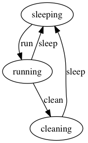
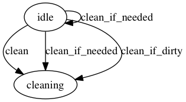
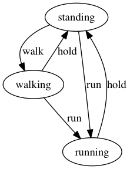
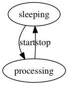

# AASM Diagram

[AASM Diagram](https://github.com/katee/aasm-diagram) creates diagrams for [AASM](https://github.com/aasm/aasm) state machines. To take an example from the AASM Readme:

```ruby
require 'aasm-diagram'

class Job
  include AASM

  aasm do
    state :sleeping, :initial => true
    state :running, :cleaning

    event :run do
      transitions :from => :sleeping, :to => :running
    end

    event :clean do
      transitions :from => :running, :to => :cleaning
    end

    event :sleep do
      transitions :from => [:running, :cleaning], :to => :sleeping
    end
  end
end

AASMDiagram::Diagram.new(Job.aasm, 'docs/job.png')
```

Generates the following diagram:



## Installation

- Install Graphviz ([see the rails-erd guide for more details](https://voormedia.github.io/rails-erd/install.html)). If you use Homebrew try `brew install graphviz`.
- Add `gem 'aasm-diagram', require: false, group: :development` to your `Gemfile` and run `bundle`.

## Integration

The gem exposes the `generate` Rake task, that can be used to generate the diagrams of state machines into
PNG images. The `generate` task accepts two parameters:

- the name of the model, in underscored format, will be CamelCased by the task
- the name of the state machine, for models with multiple AASMs; this argument is optional

The task will output the PNG image by default to the `/tmp` folder; but can be configured via the
`AASM_DIAGRAM_OUTPUT_DIR` environment variable to write the files to another folder.

The filenames are generated based on the parameters as follows `model_name-state_machine_name.png`.
If no state machine name is provided, the task will use `default` for the file name.

```sh
# for the Order model and the :dropoff state machine
rake aasm-diagram:generate[order,dropoff] # -> tmp/order-dropoff.png

# for the Invoice model and the "default" state machine
rake aasm-diagram:generate[invoice] # -> tmp/invoice-default.png

# with custom output directory
AASM_DIAGRAM_OUTPUT_DIR=docs rake aasm-diagram:generate[invoice] # -> docs/invoice-default.png
```

### Rails

Once installed, the gem automatically integrates with Rails via Railties and exposes the task automatically.

`rails aasm-diagram:generate[my_model,my_state_machine]`

If the model contains only one state machine, or you just want to generate for the "default" one
you can skip the state machine name parameter.

`rails aasm-diagram:generate[my_model]`

### Plain Ruby

For plain Ruby projects the gem includes a Rakefile that can be loaded in your project's Rakefile,
using source code along the lines of:

```ruby
# in Rakefile

require 'aasm-diagram'

spec = Gem::Specification.find_by_name 'aasm-diagram'
rakefile = "#{spec.gem_dir}/lib/aasm_diagram/Rakefile"
load rakefile
```

## More Examples

### Guards

```ruby
class Cleaner
  include AASM

  aasm do
    state :idle, :initial => true
    state :cleaning

    event :clean do
      transitions :from => :idle, :to => :cleaning, :guard => :cleaning_needed?
    end

    event :clean_if_needed do
      transitions :from => :idle, :to => :cleaning do
        guard do
          cleaning_needed?
        end
      end
      transitions :from => :idle, :to => :idle
    end

    event :clean_if_dirty do
      transitions :from => :idle, :to => :cleaning, :guard => :if_dirty?
    end
  end

  def cleaning_needed?
    false
  end

  def if_dirty?(status)
    status == :dirty
  end
end

AASMDiagram::Diagram.new(Cleaner.aasm, '../docs/guard-cleaner.png')
```



### Multiple state machines per class

```ruby
class SimpleMultipleExample
  include AASM
  aasm(:move) do
    state :standing, :initial => true
    state :walking
    state :running

    event :walk do
      transitions :from => :standing, :to => :walking
    end
    event :run do
      transitions :from => [:standing, :walking], :to => :running
    end
    event :hold do
      transitions :from => [:walking, :running], :to => :standing
    end
  end

  aasm(:work) do
    state :sleeping, :initial => true
    state :processing

    event :start do
      transitions :from => :sleeping, :to => :processing
    end
    event :stop do
      transitions :from => :processing, :to => :sleeping
    end
  end
end

AASMDiagram::Diagram.new(SimpleMultipleExample.aasm(:move), 'docs/multiple-state-machines-1.png')
AASMDiagram::Diagram.new(SimpleMultipleExample.aasm(:work), 'docs/multiple-state-machines-2.png')
```

Generates two images:




## Notes

AASM Diagram is heavily inspired by [rails-erd](https://github.com/voormedia/rails-erd).

## License

The gem is available as open source under the terms of the [MIT License](http://opensource.org/licenses/MIT).
